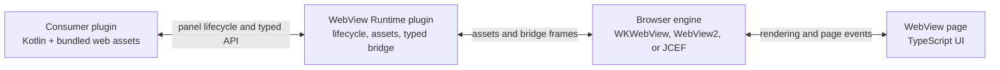

# WebView Runtime for IntelliJ

Build rich IDE interfaces with HTML, CSS, TypeScript, and your preferred frontend framework—without running a local web server.

WebView Runtime is an experimental, independently installed plugin for IntelliJ-based IDEs. A plugin owns the Kotlin lifecycle and business logic, bundles static frontend assets, and communicates with the page through typed Kotlin/TypeScript contracts.

## What It Provides

- Bundled frontend assets served from plugin resources through a virtual WebView origin.
- A typed JSON-RPC bridge built around `WebViewApi`, `WebViewApiId`, and `WebViewInterop`.
- A small TypeScript API exposed as `@nerzhulart/intellij-webview-sdk`.
- Native WKWebView and WebView2 backends, plus JCEF fallback.
- Browser previews, deterministic host mocks, and Playwright smoke tests.
- Shared Web Components and optional React controls styled for IDE UI.



## Create a WebView

Create and own the panel from Kotlin:

```kotlin
private val assetRoot = WebViewAssetRoot.forView("editor-tools")

suspend fun createEditorToolsPanel(scope: CoroutineScope): WebViewPanel {
  return createWebViewPanel(
    scope = scope,
    options = WebViewPanelOptions(
      assetRoot = assetRoot,
      debugName = "Editor tools",
    ),
  )
}
```

The supplied `CoroutineScope` is the panel's lifetime owner. Cancel that scope when the owning UI is disposed; `WebViewPanel` has no separate `close()` method.

Define the same typed contract on both sides. Kotlin implements an API called by the page:

```kotlin
@Serializable
data class OpenFileRequest(val path: String)

interface EditorHostApi : WebViewImplementable {
  companion object {
    val ID: WebViewApiId<EditorHostApi> = WebViewApiId.of("editor.host")
  }

  suspend fun openFile(params: OpenFileRequest)
}

panel.interop.implement(EditorHostApi.ID, editorHostApi)
```

TypeScript calls it through `@nerzhulart/intellij-webview-sdk`:

```ts
import { apiId, webView, type WebViewCallable } from "@nerzhulart/intellij-webview-sdk"

interface EditorHostApi extends WebViewCallable {
  openFile(params: { path: string }): Promise<void>
}

const editorHostApiId = apiId<EditorHostApi>()("editor.host")
await webView.callable(editorHostApiId).openFile({ path: "src/Main.kt" })
```

See the [WebView UI Authoring Guide](docs/guides/WebView-UI-Authoring-Guide.md) for complete lifecycle, build, protocol, preview, and testing guidance.

## Install and Depend on the Runtime

Build or download the WebView Runtime ZIP, install it in the target IDE, and declare the external plugin dependency in the consumer plugin descriptor:

```xml
<dependencies>
  <plugin id="io.github.nerzhulart.webview"/>
</dependencies>
```

`io.github.nerzhulart.webview` is the existing technical plugin ID. The runtime is not bundled with the IDE and must be installed alongside the consumer plugin.

The source manifests remain private workspace packages, while releases publish public npm packages under `@nerzhulart`. Keep the canonical imports and install the exact package version that matches the runtime plugin:

```json
{
  "devDependencies": {
    "@nerzhulart/intellij-webview-sdk": "0.1.0",
    "@nerzhulart/intellij-webview-sdk-testkit": "0.1.0"
  }
}
```

Do not use floating semver ranges for these packages. See [Frontend Package Distribution](docs/frontend/WebView-Frontend-Package-Distribution.md) for the package contract.

## Backend Support

| Backend | Current support |
| --- | --- |
| macOS WKWebView | Asset serving, typed messaging, Swing embedding, and interactive input |
| Windows WebView2 | Asset serving, typed messaging, Swing embedding, and interactive input |
| JCEF | Asset serving, typed messaging, Swing embedding, and interactive input |
| Linux WebKitGTK | Disabled implementation scaffold; supported Linux panels use JCEF |

## Project Status

The runtime and its public APIs are experimental. Compatibility may change between plugin releases.

Current distribution limitations:

- Releases are GitHub Release assets, not Marketplace publications.
- Source and published npm packages use the same `@nerzhulart/*` coordinates.
- Kotlin IDE test sources remain in the repository but are not wired into the standalone Gradle build.
- The target IDE build and minimum compatible build are configured in `gradle.properties` and `build.gradle.kts`.

## Build and Run

Use a JDK whose major version matches the selected binary IntelliJ SDK and the Gradle toolchain declared by this repository. Keep the SDK version, Gradle toolchain, Kotlin JVM target, and CI runtime aligned when upgrading the target IDE.

Install Bun through Homebrew or make it available on `PATH`, then run:

```shell
./gradlew buildPlugin :demo:buildPlugin :markdown-preview:buildPlugin
./gradlew runIde
```

On Windows, use `gradlew.bat` instead of `./gradlew`. A clean checkout requires the one-time wrapper bootstrap documented in [Standalone Development and Verification](docs/guides/Standalone-Development-and-Verification.md#bootstrap-the-gradle-wrapper).

The plugin ZIPs are written to the `build/distributions`, `demo/build/distributions`, and `markdown-preview/build/distributions` directories. For prerequisites, frontend commands, native builds, verification, and the release workflow, see [Standalone Development and Verification](docs/guides/Standalone-Development-and-Verification.md).

## Repository Guide

- `src/` — public Kotlin API and runtime implementation.
- `webview-src/` — TypeScript bridge, build helpers, testkit, and shared controls.
- `jcef/` — optional JCEF backend content module.
- `demo/` — runnable examples and browser-preview references.
- `markdown-preview/` — external Markdown preview plugin built on the runtime.
- `native/` — native system-WebView bridges.

Start at [WebView Runtime Documentation](docs/directory.md) for the complete documentation map.
