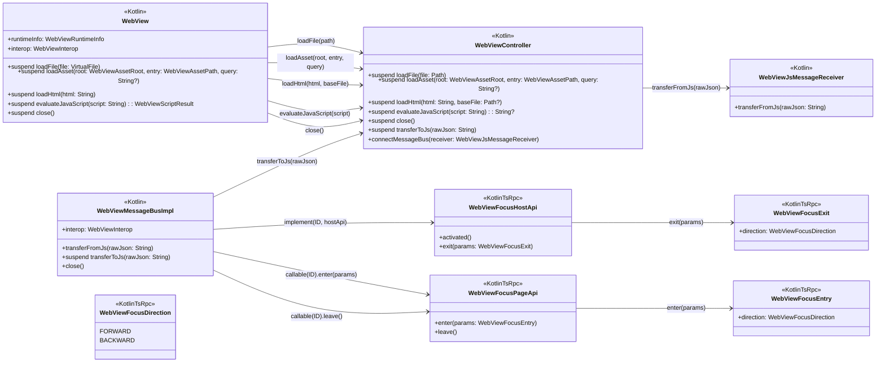
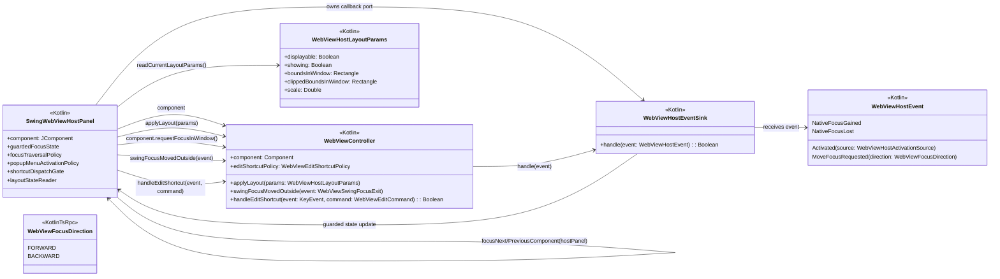
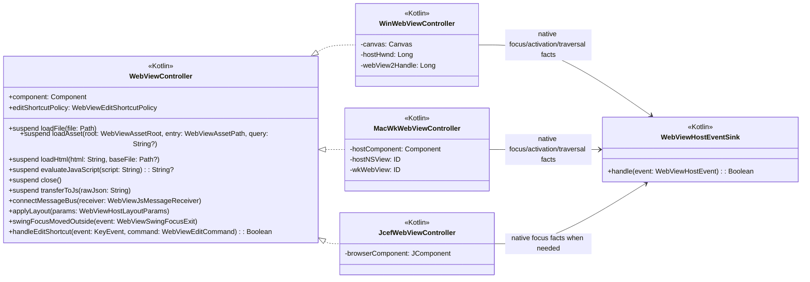

# Architecture Diagrams

Status: plan.

The diagrams below use full type APIs in nodes and call names on edges. Every owned type node is marked with its source side: `<<Kotlin>>` for Kotlin-only types, `<<KotlinTsRpc>>` for mirrored Kotlin/TS RPC protocol types, `<<Rust>>` for native bridge implementation types, and `<<WebView2COM>>` for WebView2 COM types. JVM/Swing/JDK value types such as `Component`, `KeyEvent`, `String`, or `Boolean` are external library types and are not repeated as nodes. The diagrams describe the target architecture, not the current class layout. Each platform diagram node is one `WebViewController` (Kotlin) that fully owns one WebView. For Windows, `WinWebViewController` is driven by the AWT-owned Canvas thread; the Rust native library does not create a separate event loop, window procedure, or UI thread.

## Creation and ownership

```mermaid
classDiagram
direction LR

class WebViewRuntime {
  <<Kotlin>>
  +suspend createWebView(scope: CoroutineScope, options: WebViewCreationOptions): WebView
  +createController(scope: CoroutineScope, engineKind: WebViewEngineKind, jcefNativeBundlePath: Path?): WebViewController
  +suspend createWebViewPanel(scope: CoroutineScope, options: WebViewPanelOptions): WebViewPanel
}

class WebViewEngineProvider {
  <<Kotlin>>
  +id: WebViewEngineId
  +displayName: String
  +capabilities: WebViewEngineCapabilities
  +selectionPriority(preference: WebViewEngineKind): Int?
  +suspend availability(): WebViewEngineAvailability
  +availabilityBlocking(): WebViewEngineAvailability
  +createController(scope: CoroutineScope, options: WebViewEngineCreationOptions, hostEvents: WebViewHostEventSink): WebViewController
}

class WebViewController {
  <<Kotlin>>
  +suspend loadFile(file: Path)
  +suspend loadAsset(root: WebViewAssetRoot, entry: WebViewAssetPath, query: String?)
  +suspend loadHtml(html: String, baseFile: Path?)
  +suspend evaluateJavaScript(script: String): String?
  +suspend close()
  +suspend transferToJs(rawJson: String)
  +connectMessageBus(receiver: WebViewJsMessageReceiver)
  +component: Component
  +editShortcutPolicy: WebViewEditShortcutPolicy
  +applyLayout(params: WebViewHostLayoutParams)
  +swingFocusMovedOutside(event: WebViewSwingFocusExit)
  +handleEditShortcut(event: KeyEvent, command: WebViewEditCommand): Boolean
}

class WebViewHostEventSink {
  <<Kotlin>>
  +handle(event: WebViewHostEvent): Boolean
}

class WebViewHostEvent {
  <<Kotlin>>
  NativeFocusGained
  NativeFocusLost
  Activated(source: WebViewHostActivationSource)
  MoveFocusRequested(direction: WebViewFocusDirection)
}

class CreatedWebViewHost {
  <<Kotlin>>
  +webView: WebView
  +controller: WebViewController
  +hostPanel: SwingWebViewHostPanel
  +close(): Unit
}

class WebViewPanel {
  <<Kotlin>>
  +webView: WebView
  +component: JComponent
  +interop: WebViewInterop
  +suspend reload()
  +suspend close()
}

WebViewRuntime --> WebViewEngineProvider : selectProvider(preference, requirements)
WebViewRuntime --> WebViewEngineProvider : createController(scope, options, hostEvents)
WebViewEngineProvider --> WebViewController : construct selected controller
WebViewController --> WebViewHostEventSink : reports native facts
WebViewRuntime --> WebViewController : connectMessageBus(receiver)
WebViewRuntime --> CreatedWebViewHost : construct(controller, hostPanel)
CreatedWebViewHost --> WebViewPanel : expose(component = hostPanel)
WebViewPanel --> CreatedWebViewHost : close()
CreatedWebViewHost --> WebViewController : close()
```

## Runtime transport and page API

This diagram shows the Kotlin/TS RPC transport surface. It does not make page-side focus-boundary messages the universal native focus mechanism. Windows must use WebView2 controller focus and traversal events for the paths they cover; `MacWkWebViewController` may use a private controller-owned TypeScript boundary detector only until a native AppKit-only traversal path is proven.

## Swing layout and focus policy

`WebViewHostEventSink` in this diagram means constructor-provided lambdas or an anonymous callback object owned by `SwingWebViewHostPanel` (Kotlin). It is not a second controller. Its only job is to let the selected controller report native focus, host/native activation, and native traversal requests back into the guarded Swing host state.

## Platform controller implementations

`WinWebViewController`, `MacWkWebViewController`, and `JcefWebViewController` are the only per-WebView platform implementation hierarchy. Each fully owns one WebView. Do not introduce per-platform `*Engine`, `*HostController`, `*Backend`, tuple, or facet-delegate classes. Native operations such as attaching to an HWND/NSView, changing WebView2 bounds, AppKit first-responder cleanup, or JCEF focus calls stay as private methods or narrow non-polymorphic helpers of the selected controller.

`WebViewEngineKind`, `WebViewEngineId`, capabilities, availability, and the provider name in the diagram are common selection metadata retained from the external/runtime selection API. They do not define a second per-OS implementation hierarchy. `createController(...)` is the only per-WebView construction operation.

## Windows native bridge

```mermaid
classDiagram
direction LR

class WinWebViewController {
  <<Kotlin>>
  +applyLayout(params: WebViewHostLayoutParams)
  +swingFocusMovedOutside(event: WebViewSwingFocusExit)
  +handleEditShortcut(event: KeyEvent, command: WebViewEditCommand): Boolean
  +suspend loadFile(file: Path)
  +suspend loadAsset(root: WebViewAssetRoot, entry: WebViewAssetPath, query: String?)
  +suspend loadHtml(html: String, baseFile: Path?)
  +suspend evaluateJavaScript(script: String): String?
  +suspend transferToJs(rawJson: String)
  +connectMessageBus(receiver: WebViewJsMessageReceiver)
  +suspend close()
}

class WinWebView2BridgeApi {
  <<Kotlin>>
  +create(hostHwnd: Long, userDataDir: String, documentStartScript: String, callbacks: Callbacks): Long
  +destroy(handle: Long)
  +setBounds(handle: Long, x: Int, y: Int, width: Int, height: Int, scale: Double)
  +setVisible(handle: Long, visible: Boolean)
  +focus(handle: Long)
  +loadUrl(handle: Long, url: String)
  +setVirtualHostNameToFolderMapping(handle: Long, hostName: String, folderPath: String)
  +loadHtml(handle: Long, html: String, baseUrl: String?)
  +evaluateJavaScript(handle: Long, evalId: Long, script: String)
  +callDevToolsProtocolMethod(handle: Long, callId: Long, methodName: String, paramsJson: String)
  +transferToJs(handle: Long, rawJson: String)
}

class Callbacks {
  <<Kotlin>>
  +onCreated(handle: Long)
  +onCreateFailed(message: String)
  +onMessage(raw: String)
  +onAcceleratorKeyPressed(keyEventKind: Int, virtualKey: Int, modifiers: Int, keyEventLParam: Int): Boolean
  +onFocusGained()
  +onFocusLost()
  +onMoveFocusRequested(reason: Int): Boolean
  +onLog(level: Int, message: String)
  +onNativeDiagnostic(level: Int, event: String, message: String, data: String)
  +resolveAsset(url: String): AssetResponse?
}

class RustWebView2Bridge {
  <<Rust>>
  +create(hostHwnd, userDataDir, documentStartScript, callbacks)
  +destroy(handle)
  +setBounds(handle, x, y, width, height, scale)
  +setVisible(handle, visible)
  +focus(handle)
  +loadUrl(handle, url)
  +loadHtml(handle, html, baseUrl)
  +evaluateJavaScript(handle, evalId, script)
  +callDevToolsProtocolMethod(handle, callId, methodName, paramsJson)
  +transferToJs(handle, rawJson)
}

class ICoreWebView2Controller {
  <<WebView2COM>>
  +CreateCoreWebView2ControllerWithOptions(hostHwnd, options, handler)
  +SetBounds(bounds)
  +SetIsVisible(visible)
  +MoveFocus(PROGRAMMATIC)
  +add_GotFocus(handler)
  +add_LostFocus(handler)
  +add_MoveFocusRequested(handler)
  +add_AcceleratorKeyPressed(handler)
}

WinWebViewController --> WinWebView2BridgeApi : create(hostHwnd, userDataDir, documentStartScript, callbacks)
WinWebViewController --> WinWebView2BridgeApi : setBounds(handle, x, y, width, height, scale)
WinWebViewController --> WinWebView2BridgeApi : setVisible(handle, visible)
WinWebViewController --> WinWebView2BridgeApi : focus(handle)
WinWebViewController --> WinWebView2BridgeApi : loadUrl(handle, url)
WinWebViewController --> WinWebView2BridgeApi : loadHtml(handle, html, baseUrl)
WinWebViewController --> WinWebView2BridgeApi : evaluateJavaScript(handle, evalId, script)
WinWebViewController --> WinWebView2BridgeApi : transferToJs(handle, rawJson)
WinWebView2BridgeApi --> RustWebView2Bridge : JNI native calls
RustWebView2Bridge --> ICoreWebView2Controller : CreateCoreWebView2ControllerWithOptions(hostHwnd, options, handler)
RustWebView2Bridge --> ICoreWebView2Controller : SetBounds(bounds)
RustWebView2Bridge --> ICoreWebView2Controller : SetIsVisible(visible)
RustWebView2Bridge --> ICoreWebView2Controller : MoveFocus(PROGRAMMATIC)
ICoreWebView2Controller --> Callbacks : onFocusGained()
ICoreWebView2Controller --> Callbacks : onFocusLost()
ICoreWebView2Controller --> Callbacks : onMoveFocusRequested(reason)
ICoreWebView2Controller --> Callbacks : onAcceleratorKeyPressed(...)
Callbacks --> WinWebViewController : apply callback state
```

